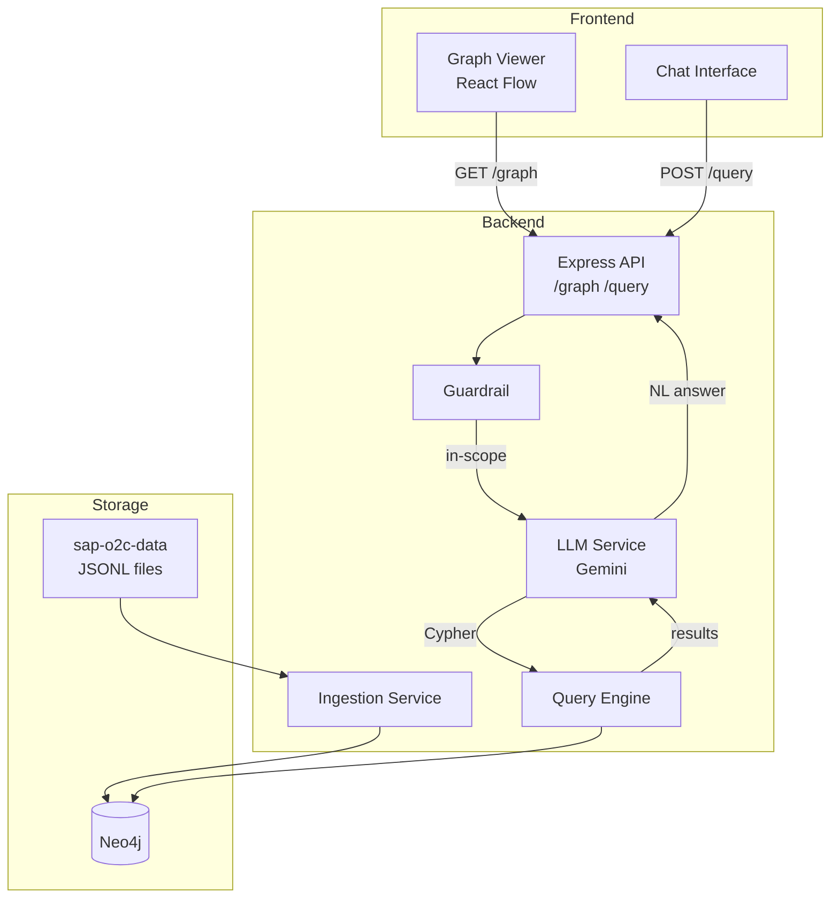
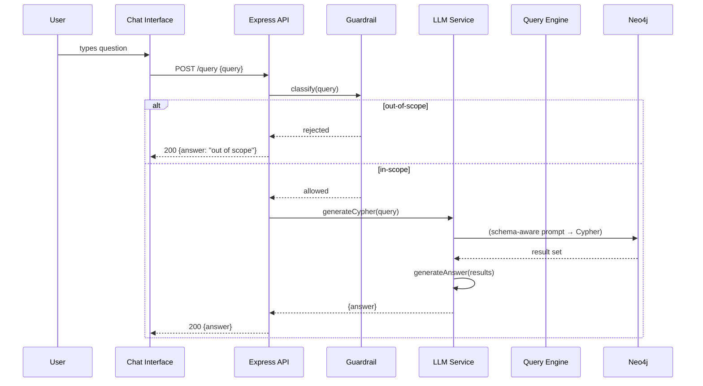
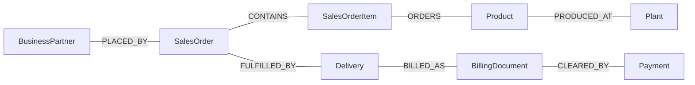

# Design Document: Graph-Based Query System

## Overview

The Graph-Based Query System ingests SAP Order-to-Cash (O2C) JSONL data into a Neo4j property graph, exposes a REST API for graph retrieval and natural-language querying, and renders an interactive graph visualization with a chat interface in React.

The system follows a three-tier architecture:
- **Frontend** — React + React Flow + Tailwind CSS (graph viewer + chat)
- **Backend** — Node.js + Express (REST API, ingestion, LLM orchestration)
- **Database** — Neo4j (property graph storage and Cypher execution)

The query pipeline is: user NL input → Guardrail → Gemini (NL→Cypher) → Neo4j → Gemini (results→NL) → user.

---

## Architecture



### Request Flow — POST /query



---

## Components and Interfaces

### Backend Modules

```
backend/
  src/
    ingestion/
      ingestionService.js     # orchestrates all loaders
      jsonlParser.js          # line-by-line JSONL reader/parser
      loaders/                # one file per entity type
        businessPartnerLoader.js
        salesOrderLoader.js
        productLoader.js
        deliveryLoader.js
        billingDocumentLoader.js
        paymentLoader.js
        plantLoader.js
    graph/
      neo4jDriver.js          # singleton Neo4j driver
      graphRepository.js      # GET /graph query (nodes + edges)
    llm/
      llmService.js           # Gemini API client, prompt builder
    query/
      queryEngine.js          # executes Cypher, returns raw results
    guardrail/
      guardrail.js            # keyword/intent classifier
    routes/
      graphRoutes.js          # GET /graph
      queryRoutes.js          # POST /query
    app.js
    server.js
```

### Frontend Modules

```
frontend/src/
  components/
    GraphViewer.jsx           # React Flow canvas
    NodePanel.jsx             # metadata side panel on node click
    ChatInterface.jsx         # message list + input bar
    LoadingSpinner.jsx
  hooks/
    useGraph.js               # fetches GET /graph
    useChat.js                # manages POST /query + history
  constants/
    nodeColors.js             # label → color map
  App.jsx
```

### API Contract

**GET /graph**
```json
{
  "nodes": [
    { "id": "bp-310000108", "label": "BusinessPartner",
      "properties": { "businessPartnerFullName": "...", ... } }
  ],
  "edges": [
    { "id": "e-so-740506-bp-310000108", "source": "so-740506",
      "target": "bp-310000108", "type": "PLACED_BY" }
  ]
}
```

**POST /query**
- Request: `{ "query": "Which customers have unpaid invoices?" }`
- Response (200): `{ "answer": "Three customers have unpaid invoices: ..." }`
- Response (200, out-of-scope): `{ "answer": "This question is outside the scope of the O2C dataset." }`
- Response (502): `{ "message": "LLM service unavailable." }`
- Response (503): `{ "message": "Database unreachable." }`
- Response (500): `{ "message": "Query execution failed." }`

---

## Data Models

### Graph Schema



### Node Properties

| Node | Key | Key Properties |
|------|-----|----------------|
| BusinessPartner | `businessPartner` | `businessPartnerFullName`, `businessPartnerGrouping`, `businessPartnerIsBlocked`, `isMarkedForArchiving` |
| SalesOrder | `salesOrder` | `soldToParty`, `totalNetAmount`, `transactionCurrency`, `overallDeliveryStatus`, `creationDate`, `requestedDeliveryDate` |
| SalesOrderItem | `salesOrder` + `salesOrderItem` | `material`, `requestedQuantity`, `requestedQuantityUnit`, `netAmount` |
| Product | `material` | `productDescription`, `baseUnit` |
| Delivery | `deliveryDocument` | `overallGoodsMovementStatus`, `overallPickingStatus`, `creationDate` |
| BillingDocument | `billingDocument` | `totalNetAmount`, `transactionCurrency`, `billingDocumentIsCancelled`, `soldToParty`, `accountingDocument` |
| Payment | `accountingDocument` + `accountingDocumentItem` | `amountInTransactionCurrency`, `transactionCurrency`, `clearingDate`, `customer` |
| Plant | `plant` | `shippingPoint` (from delivery items) |

### Relationship Join Keys

| Relationship | From → To | Join Key |
|---|---|---|
| PLACED_BY | SalesOrder → BusinessPartner | `salesOrder.soldToParty = businessPartner.businessPartner` |
| CONTAINS | SalesOrder → SalesOrderItem | `salesOrder.salesOrder = salesOrderItem.salesOrder` |
| ORDERS | SalesOrderItem → Product | `salesOrderItem.material = product.material` |
| FULFILLED_BY | SalesOrder → Delivery | `outbound_delivery_items.referenceSdDocument = salesOrder.salesOrder` |
| BILLED_AS | Delivery → BillingDocument | `billing_document_items.referenceSdDocument = delivery.deliveryDocument` |
| CLEARED_BY | BillingDocument → Payment | `billingDocument.accountingDocument = payment.accountingDocument` |
| PRODUCED_AT | Product → Plant | `salesOrderItem.productionPlant = plant.plant` |

### Neo4j Indexes (created on startup)

```cypher
CREATE CONSTRAINT bp_id IF NOT EXISTS FOR (n:BusinessPartner) REQUIRE n.businessPartner IS UNIQUE;
CREATE CONSTRAINT so_id IF NOT EXISTS FOR (n:SalesOrder) REQUIRE n.salesOrder IS UNIQUE;
CREATE CONSTRAINT prod_id IF NOT EXISTS FOR (n:Product) REQUIRE n.material IS UNIQUE;
CREATE CONSTRAINT del_id IF NOT EXISTS FOR (n:Delivery) REQUIRE n.deliveryDocument IS UNIQUE;
CREATE CONSTRAINT bd_id IF NOT EXISTS FOR (n:BillingDocument) REQUIRE n.billingDocument IS UNIQUE;
CREATE CONSTRAINT plant_id IF NOT EXISTS FOR (n:Plant) REQUIRE n.plant IS UNIQUE;
```

Composite-key nodes (SalesOrderItem, Payment) use a generated `id` property: `salesOrder_salesOrderItem` and `accountingDocument_accountingDocumentItem`.

### JSONL Parser

`jsonlParser.js` reads a file line-by-line using Node.js `readline`, skips blank lines, attempts `JSON.parse` on each line, and emits either a parsed object or an error event with `{ file, lineNumber, error }`. It does **not** coerce types — all values are preserved as-is from the JSON source (strings stay strings, nulls stay null).

### Ingestion Idempotency

All writes use Cypher `MERGE` on the node's unique key, followed by `SET n += $props` to update properties. Relationships are also `MERGE`d on the `(source)-[r:TYPE]->(target)` pattern. This makes ingestion safe to re-run.

```cypher
MERGE (n:SalesOrder {salesOrder: $salesOrder})
SET n += $props
```

---

## Correctness Properties

*A property is a characteristic or behavior that should hold true across all valid executions of a system — essentially, a formal statement about what the system should do. Properties serve as the bridge between human-readable specifications and machine-verifiable correctness guarantees.*

### Property 1: JSONL Round-Trip Integrity

*For any* valid JSONL record in the source files, parsing the line to a JavaScript object and then serializing it back to JSON and re-parsing should produce an object deeply equal to the original parsed object.

**Validates: Requirements 9.2**

### Property 2: Null and String Preservation

*For any* JSONL record containing `null` values or numeric-string fields (e.g., `"totalNetAmount": "216.1"`), the parsed object should preserve `null` as `null` (not `undefined`) and numeric strings as strings (not floats).

**Validates: Requirements 9.4, 9.5**

### Property 3: Ingestion Idempotency

*For any* set of JSONL source files, running the ingestion pipeline twice should produce the same node and relationship counts in Neo4j as running it once — no duplicates created.

**Validates: Requirements 1.5, 2.16**

### Property 4: Graph API Node and Edge Completeness

*For any* graph stored in Neo4j, the response from `GET /graph` should contain exactly one entry per Neo4j node and one entry per Neo4j relationship, with no omissions or duplicates.

**Validates: Requirements 3.1, 3.2, 3.3**

### Property 5: Guardrail Scope Classification

*For any* query string composed entirely of O2C domain keywords (sales order, delivery, billing, payment, customer, product, plant), the Guardrail should classify it as in-scope. *For any* query string with no O2C domain keywords and clear non-O2C intent, the Guardrail should classify it as out-of-scope.

**Validates: Requirements 8.1, 8.2, 8.4**

### Property 6: Out-of-Scope Queries Return HTTP 200 with Answer Field

*For any* query rejected by the Guardrail, the API response should be HTTP 200 with a JSON body containing an `answer` field (not an error status code).

**Validates: Requirements 8.3**

### Property 7: Query Response Contains Answer Field

*For any* in-scope query that completes successfully, the `POST /query` response body should be a JSON object containing an `answer` field with a non-empty string value.

**Validates: Requirements 7.3**

---

## Error Handling

| Scenario | Component | HTTP Status | Response Body |
|---|---|---|---|
| Neo4j unreachable | graphRepository / queryEngine | 503 | `{ "message": "Database unreachable." }` |
| Gemini API error / timeout (30s) | llmService | 502 | `{ "message": "LLM service unavailable." }` |
| Cypher execution error | queryEngine | 500 | `{ "message": "Query execution failed." }` |
| Empty Cypher result | llmService | 200 | `{ "answer": "No matching data found in the dataset." }` |
| Out-of-scope query | guardrail | 200 | `{ "answer": "This question is outside the scope of the O2C dataset." }` |
| Malformed JSONL line | jsonlParser | — (log only) | Logs `{ file, lineNumber, error }`, continues |
| Missing GEMINI_API_KEY | llmService (startup) | — | Throws on startup with descriptive message |

**Timeout strategy**: `llmService` wraps the Gemini call in a `Promise.race` with a 30-second timeout. The Neo4j driver is configured with `connectionTimeout: 5000` and `maxTransactionRetryTime: 5000`.

**Error propagation**: All route handlers use a central Express error middleware that formats errors consistently and avoids leaking stack traces to clients.

---

## Testing Strategy

### Unit Tests (Jest)

Focus on specific examples, edge cases, and error conditions:

- `jsonlParser`: valid line, blank line skip, malformed JSON logs error and continues, nested object preserved, null preserved, numeric string not coerced
- `guardrail`: known in-scope phrases, known out-of-scope phrases, ambiguous phrases pass through
- `llmService`: Cypher extraction from Gemini response, timeout triggers 502, missing API key throws
- `graphRepository`: maps Neo4j records to `{ nodes, edges }` shape correctly
- React components: `ChatInterface` renders history, disables button while loading; `GraphViewer` shows loading spinner, shows error on fetch failure; `NodePanel` renders all properties

### Property-Based Tests (fast-check)

Each property test runs a minimum of **100 iterations**. Each test is tagged with a comment in the format:
`// Feature: graph-based-query-system, Property N: <property_text>`

| Property | Test Description | Library |
|---|---|---|
| P1: JSONL Round-Trip | Generate arbitrary JSON objects, serialize to JSONL line, parse, re-serialize, re-parse → deep equal | fast-check |
| P2: Null/String Preservation | Generate objects with null values and numeric-string fields, parse → nulls remain null, numeric strings remain strings | fast-check |
| P3: Ingestion Idempotency | Run ingestion twice on generated node sets, assert node/edge count unchanged | fast-check (integration) |
| P4: Graph API Completeness | Generate arbitrary node/edge sets in Neo4j, call GET /graph, assert counts match | fast-check (integration) |
| P5: Guardrail Classification | Generate strings from O2C keyword vocabulary → in-scope; generate strings from non-O2C vocabulary → out-of-scope | fast-check |
| P6: Out-of-Scope HTTP 200 | For any rejected query, assert response status 200 and body has `answer` field | fast-check |
| P7: Answer Field Present | For any in-scope query with mocked Gemini/Neo4j, assert response has non-empty `answer` | fast-check |

### Integration Tests

- Full ingestion pipeline on a sample of real JSONL files against a test Neo4j instance
- `GET /graph` returns non-empty nodes and edges after ingestion
- `POST /query` with a known O2C question returns a non-empty answer string
- `POST /query` with an out-of-scope question returns HTTP 200 with scope rejection message
